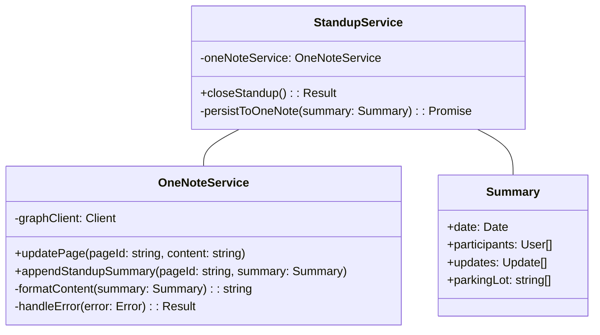
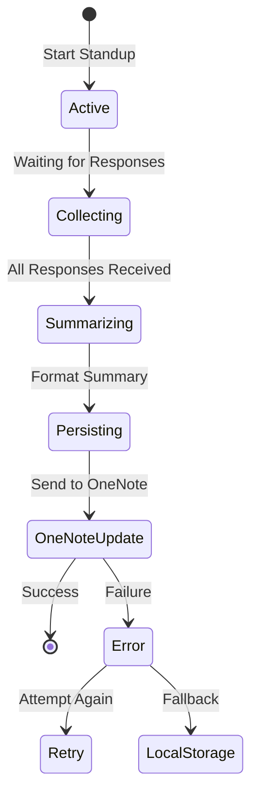

# System Patterns: OneNote Integration

## Service Architecture



## Interface Definitions

### OneNoteService

```typescript
interface OneNoteService {
  updatePage(pageId: string, content: string): Promise<Result>;
  appendStandupSummary(
    pageId: string,
    summary: StandupSummary
  ): Promise<Result>;
}

interface StandupSummary {
  date: Date;
  participants: User[];
  responses: StandupResponse[];
  parkingLot?: string[];
}

interface Result<T> {
  type: "success" | "error";
  data?: T;
  message?: string;
}
```

## Key Patterns

1. **Service Integration**

   - OneNote service as a standalone module
   - Clear separation of concerns between standup and persistence logic
   - Dependency injection for easy testing

2. **Error Handling**

   - Result type pattern for clear error states
   - Graceful degradation when OneNote is unavailable
   - Retry mechanism for transient failures

3. **Content Management**

   - HTML templating for consistent formatting
   - Structured data model for standup summaries
   - Versioning through date-based divs

4. **State Management**
   - Atomic updates to prevent data corruption
   - Cache management for better performance
   - Rollback capability for failed updates

## Flow Control



## Implementation Strategy

1. Create OneNoteService

   - Initialize with Graph client
   - Implement CRUD operations
   - Add error handling

2. Update StandupGroup

   - Add OneNote page reference
   - Implement persistence hooks
   - Handle async operations

3. Modify Standup flow
   - Integrate OneNote updates
   - Add retry logic
   - Implement fallback mechanism
