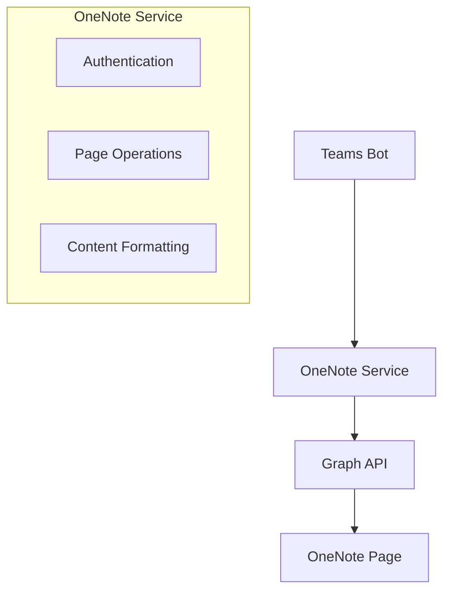
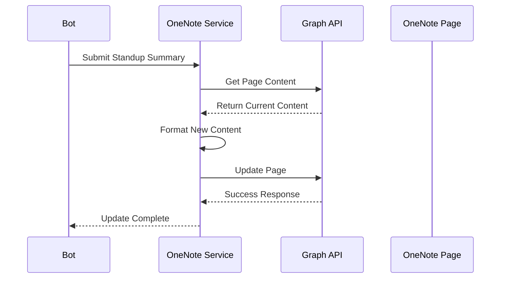

# Technical Context: OneNote Integration

## Technologies

### Core Dependencies

- Microsoft Graph API
- @microsoft/graph-client - For OneNote page interactions
- Teams Bot Framework

### Key Endpoints

- OneNote Page Update: `PATCH /groups/{id}/onenote/pages/{id}/content`

## Integration Architecture



## Authentication Requirements

1. Azure AD Application registration
2. Required permissions:
   - Notes.Create
   - Notes.ReadWrite
   - Notes.ReadWrite.All

## Data Flow



## Content Structure

- Each OneNote page will use HTML for formatting
- New standups will be prepended to maintain chronological order
- Format:

```html
<div data-standup-date="YYYY-MM-DD">
  <h1>Standup Summary - [Date]</h1>
  <div class="participants">[List of participants]</div>
  <div class="updates">[Individual updates]</div>
  <div class="parking-lot">[Parking lot items if any]</div>
</div>
```

## Error Handling Strategy

- Retry mechanism for transient failures
- Fallback to local storage if OneNote is unavailable
- Error reporting through bot interface
